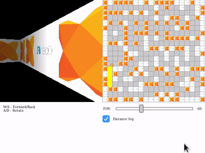

# Basic Grid-based Ray Casting

[HTML5 Build](https://miriti.github.io/openfl-raycasting/Export/html5/bin/)

Ray casting implemented with OpenFL BitmapData

## References

https://lodev.org/cgtutor/raycasting.html
